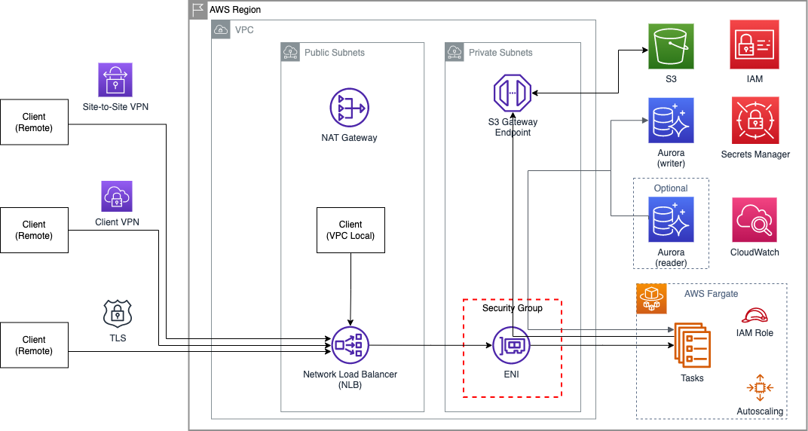

# Mirth Connect on AWS

## Introduction
This repository contains sample application to build resilient and higly-available Mirth® Connect by NextGen Healthare on AWS. Mirth Connect interprets messages of any standard into the standard your target system understands. It has capabilities such as:
1. Filtering
2. Transformation
3. Extraction
4. Routing

## Prerequisites: ##
- [AWS account](https://aws.amazon.com/premiumsupport/knowledge-center/create-and-activate-aws-account/)
- [Python3](https://www.python.org/) 
- [AWS CDK v2](https://docs.aws.amazon.com/cdk/v2/guide/getting_started.html#getting_started_prerequisites)

## Architecture



The sample uses the AWS Cloud Development Kit (CDK) to automate deployment of resources. The stack leverages Amazon Elastic Container Services (ECS) deployed on AWS Fargate to run containers without having to manage servers. The following resources are provisioned:
1. VPC, Subnets, NLB, NAT Gateway, VPC Endpoints
2. Amazon ECS Cluster, Fargate Tasks
3. Amazon Aurora Postgres database

## Mirth Configuration

The hl7v2-to-healthlake contains a sample of Mirth channels that allow HL7v2 ADT messages to be ingested in an [AWS HealthLake](https://aws.amazon.com/healthlake/) datastore (as FHIR calls)
The already compiled s4.jar library provides the function to create an AWS Signature v4 necessary for every call into Healthlake datastore from Mirth. Include that file into the /custom-lib in the container.
For manual compiling:
 1. From the hl7-to-healthlake/s4 folder run the following command:
    javac -d classes -source 8 -target 8 -Xlint src/main/java/com/amazon/s4/*
 2. Then create the s4.jar file by running this command:
    jar -cf s4.jar -C classes com

## Deployment:

Infrastructure is provisioned using AWS CDK v2. The `cdk.json` file tells the CDK Toolkit how to execute your app. 

Some variation in commands may be needed if you're running on OSX or Windows. Please refer to the [CDK](https://docs.aws.amazon.com/cdk/v2/guide/getting_started.html) and [CLI](https://docs.aws.amazon.com/cli/latest/userguide/cli-chap-getting-started.html) documentation and ensure your AWS profile and credentials are configured correctly prior to deployment.

If this is the first time you are using the AWS CDK with the AWS Account - please note the section on [Bootstrapping](https://docs.aws.amazon.com/cdk/v2/guide/getting_started.html#getting_started_bootstrap).

After cloning the repo code, the following steps can be used to set up the environment and deploy the application.

1. Create a Python virtualenv (this only needs to be done once):

```
$ python3 -m venv .mpenv
```

2. Activate the virtual environment:
```
$ source .mpenv/bin/activate
```

3. Install dependecies:
```
$ pip install -r requirements.txt
```

4. Synthesize the CloudFormation template for this code:
```
$ cdk synth
```

5. Deploy this stack to your default AWS account/region:
```
$ cdk deploy
```

You can monitor the deployment by navigating to the AWS CloudFormation [console](https://console.aws.amazon.com/cloudformation/) or by viewing the output of the `cdk deploy` command.

## Configuration

Configuration options are defined in `cfg.py`. They are used by CDK for deploying the application, or passed to the application container via environment variables.

## Security

By default, access to the application is permitted only from the VPC it is provisioned in. If you want to enable access from outside the VPC - see the `PUBLIC_LOAD_BALANCER` configuration option. To control access to the Administrator interface, and from clients - see the `ALLOWED_ADMIN_PEERS` and `ALLOWED_CHANNEL_PORTS_AND_PEERS` configuration options.

## Cost

The table below shows the resources provisioned by this CDK stack, and their respective cost.

|Resource|Description|Cost Notes|
|--------|-----------|----------|
| VPC | VPC, Nat Gateway, Subnets, Security Groups. The NAT Gateway porovides connectivity from the Fargate tasks to supporting services (CloudWatch, ECR, etc) | [VPC Pricing](https://aws.amazon.com/vpc/pricing/). Note that NAT Gateways incur Hourly, Data Processing, and Data Transfer chargers. |
| NLB | Network Load Balancer, provides connectivity and load balancing to the Fargate tasks. | [NLB Pricing](https://aws.amazon.com/elasticloadbalancing/pricing/)|
| Fargate | Application containers are deployed to Fargate, and managed with an Autoscaling Group. | Pricing will depend on the size and number of containers utlized, [Fargate Pricing](https://aws.amazon.com/fargate/pricing/).|
| Aurora | Managed relational database | [Aurora Pricing](https://aws.amazon.com/rds/aurora/pricing/)|
| Secrets Manager | Managed secrets store, store DB credentials securely | [Secrets Manager Pricing](https://aws.amazon.com/secrets-manager/pricing/)

## Cleanup

The CDK stack can be undeployed using the `cdk destroy` command.

## Useful CDK commands

 * `cdk ls`          list all stacks in the app
 * `cdk synth`       emits the synthesized CloudFormation template
 * `cdk deploy`      deploy this stack to your default AWS account/region
 * `cdk diff`        compare deployed stack with current state
 * `cdk docs`        open CDK documentation

 
